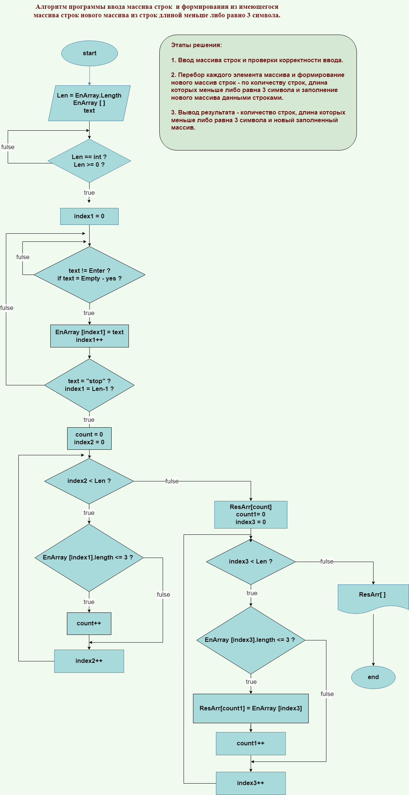

# Задача

## Написать программу, которая из имеющегося массива строк формирует массив строк, длина которых меньше либо равна 3 символа.

Примеры:

["hello", "2", "world", ":-)"] -> ["2", ":-)"];

["1234", "1567", "-2", "computer science"] -> ["-2"];

["Russia", "Iran", "Cuba"] -> [].

# продолжение СМ.НИЖЕ задания (листа с текстом задачи) >>> 

## Для решения задачи применим два варианта кода.

## Вариант 1 - с использованием Коллекции список List<> - приложение List_option.

### Описание алгоритма:
 - программа запрашивает ввод каждого элемента текстового массива - принимает ввод с клавиатуры символьно-буквенных выражений. Введенные элементы добавляются в список и наполняют его - окончание ввода производится по значению кодового слова < stop >;

 - при вводе элементов массива производится проверка:
 - - если ввод не выполнен и нажата клавища Enter - программа требует ввод текущего элемента массива;
 - - если введена пустая строка - программа спрашивает подтверждение ввода пустой строки либо предлагает отказаться и ввести иное значение;
 - - если не задано элементов списка (массива) - программа на выходе сообщает об этом;

 - программа выводит в консоль заполненный список с разделителями для каждого элемента и подсветкой (нижним подчеркиванием) количества символов в пустых строках при наличии;

 - программа из имеющегося массива строк перебором каждого элемента списка формирует новый список (массив) строк, длина которых меньше либо равна 3 символа, количество символов задано (зафиксировано в коде) **const int** переменной;

 - программа выводит в консоль результат - количество строк, длина которых меньше либо равна 3 символа и печатает в консоли новый заполненный список с разделителями для каждого элемента и подсветкой (нижним подчеркиванием) количества символов в пустых строках при наличии;

 - программа также выдает результат - сообщение об отсутствии в новом списке (массиве) строк с длиной  меньше либо равной 3 символа, если их нет.

В программе реализованы алгоритмы изменения цветов текста и символов при отображении информации в консоли - для приятного диалога при вводе/выводе и подсветки неверных действий.

При выводе строк списка (массива) в печать реализованы цветовые решения формата печати и размещение строки в рамках заданного поля с выравниванием относительно правого края ячейки.

Алгоритм программы реализован посредством резделения операций на методы - представлены в соответствующем разделе перед кодом решения.

## Вариант 2 - с использованием массивов - согласно рекомендации в задании - приложение Array_option.

### Описание алгоритма:
- программа запрашивает ввод предполагаемого размера массива и ввод каждого элемента текстового массива - принимает на вход вводимые с клавиатуры символьно-буквенные выражения. Введенные элементы заполняют пустые значения массива - окончание ввода производится по значению кодового слова < stop > или значению размера массива - при полном его заполнении;

- программа запрашивает ввод количества символов в строке для сортировки массива по элементам строк, длина которых меньше или равна количеству заданных символов;

 - при вводе величины количества символов производится проверка на целочисленное значение и значение больше нуля; 
 - при вводе элементов массива производится проверка:
 - - переменной размера массива - на целочисленное значение и значение больше нуля; 
 - - если ввод не выполнен и нажата клавища Enter - программа требует ввод текущего элемента массива;
 - - если введена пустая строка - программа спрашивает подтверждение ввода пустой строки либо предлагает отказаться и ввести иное значение;
 - - если элементы списка (массива) не заданы - программа на выходе сообщает об этом;

 - - программа из заданного массива создает новый массив по количеству заполненных строк;

 - программа выводит в консоль заполненный список с разделителями для каждого элемента и подсветкой (нижним подчеркиванием) количества символов в пустых строках при наличии;

 - программа из имеющегося массива строк перебором каждого элемента массива формирует новый массив строк - по количеству строк, длина которых меньше либо равна заданному значению и заполняет массив данными строками;

- программа выводит в консоль результат - количество строк, длина которых меньше либо равна заданному значению символов и печатает в консоли новый заполненный список с разделителями для каждого элемента и подсветкой (нижним подчеркиванием) количества символов в пустых строках при наличии;

 - программа также выдает результат - сообщение об отсутствии в новом списке (массиве) строк с длиной  меньше либо равной заданного значения символов, если их нет.

В программе реализованы алгоритмы изменения цветов текста и символов при отображении информации в консоли - для приятного диалога при вводе/выводе и подсветки неверных действий.

При выводе строк списка (массива) в печать реализованы цветовые решения формата печати и размещение строки в рамках заданного поля с выравниванием относительно правого края ячейки.

Алгоритм программы реализован посредством резделения операций на методы - представлены в соответствующем разделе перед кодом решения.

***Вариант 1 - с использованием Коллекции список List<> - содержит на 60 строк меньше кода (на 27 % меньше) по сравнению с Вариантом 2 - с использованием массивов - поскольку для работы с массивами требуется выполнить больше операций, в т.ч. контрольных - для решения задачи итоговой проверочной работы.***

* Представленный ниже алгоритм реализации изначально составлен под условия задачи (3 символа) - функционал произвольного задания количества символов по запросу был реализован позднее - при написании кода - в блок схеме не отображен. 

